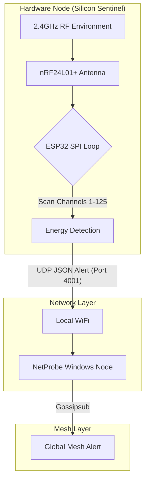

# Silicon Sentinel (V1): Hardware Specification

The **Silicon Sentinel** is a dedicated RF hardware probe designed to augment the NetProbe mesh. It performs high-speed sweeps of the 2.4GHz spectrum using an nRF24L01+ transceiver, reporting interference events back to the Windows mesh via UDP.

---

## 1. Component List

| Component | Specification | Purpose |
| :--- | :--- | :--- |
| **Microcontroller** | ESP32-WROOM-32 (38-pin DevKit) | Processing and WiFi connectivity |
| **RF Transceiver** | nRF24L01+ PA + LNA | Spectrum sensing (with external antenna) |
| **Power Stability** | 100µF Electrolytic Capacitor | Filters current spikes from the PA+LNA |
| **Power Supply** | 5V USB-C or Micro-USB | Standard ESP32 power rail |

---

## 2. Wiring Diagram (SPI Configuration)

The Sentinel utilizes the ESP32 **VSPI** hardware bus for low-latency spectrum scanning.

| nRF24L01+ Pin | ESP32 Pin (GPIO) | Board Label | Function |
| :--- | :--- | :--- | :--- |
| **GND** | **GND** | GND | Ground |
| **VCC** | **3V3** | 3V3 | 3.3V Power (Attach Capacitor here) |
| **CE** | **GPIO 4** | D4 | Chip Enable (TX/RX Control) |
| **CSN** | **GPIO 5** | D5 | SPI Chip Select |
| **SCK** | **GPIO 18** | D18 | SPI Clock |
| **MOSI** | **GPIO 23** | D23 | SPI Master Out |
| **MISO** | **GPIO 19** | D19 | SPI Master In |
| **IRQ** | *Unused* | - | Interrupt Request |

> **Note:** Solder the 100µF capacitor directly across the `VCC` and `GND` pins of the nRF24L01+ module to prevent "phantom noise" caused by voltage dips during high-power sweeps.

---

## 3. System Architecture



---

## 4. Communication Protocol (UDP)

The Sentinel broadcasts a JSON payload to the local network when RF energy exceeds a predefined threshold.

### Payload Schema
```json
{
  "dev": "Sentinel-01",
  "status": "Active",
  "alerts": [
    {
      "ch": 6,
      "pwr": -45,
      "type": "Interference"
    }
  ]
}
```

- `dev`: Unique identifier for the hardware sensor.
- `ch`: The 2.4GHz channel (1-125) where noise was detected.
- `pwr`: Relative Power Level (reported in dBm equivalent).
- `type`: Category of detected signal (e.g., "Interference", "Jamming").

---

## 5. Deployment Best Practices

1. **Antenna Orientation**: Position the external antenna vertically for optimal 360-degree radial coverage.
2. **Isolation**: Avoid placing the Sentinel directly next to high-power routers to prevent local saturation of the LNA (Low Noise Amplifier).
3. **Enclosure**: If using a custom 3D printed case, ensure the antenna is mounted externally. Non-metallic enclosures are required to avoid signal attenuation.
